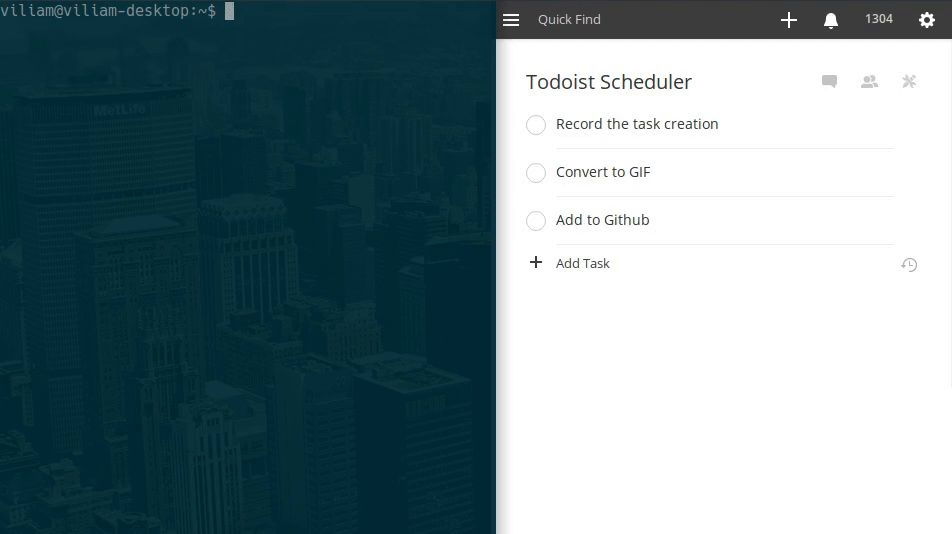

# Todoist Scheduler
Todoist Scheduler is a simple script that handles one-time and recurring tasks in plain text and creates tasks in [Todoist](http://www.todoist.com) when they are needed.



## Motivation
I made Todoist Scheduler because I wanted more control over my recurring tasks in Todoist. I spend some time every week decluttering  - deleting old contacts, archiving emails, organizing files. I liked the idea of having a list of tasks and looping over it in Todoist in specified intervals. However, to my knowledge, it is not possible. That's why I created this script and liked the clean look of empty Todolist (no recurring tasks that are not needed for 2 months) so I extended the functionality to one-time tasks as well. If you think that you might like the look of clean Todoist and have more control over recurring tasks, give it a try.

## Dependencies
- [Dateutil](https://dateutil.readthedocs.io/en/stable/)
- [PyTodoist](https://github.com/Garee/pytodoist)
- [toml](https://github.com/uiri/toml)

## Setup
#### 1. Install the dependencies:
```bash
    $ pip install pytodoist python-dateutil toml
```
#### 2. Download `*.py` files:
```bash
    $ git clone https://github.com/ViliamV/todoist_scheduler.git
    $ cd todoist_scheduler/
```
#### 3. Run `todoist_scheduler.py --first` with parameter and follow the instructions:
```bash
    $ ./todoist_scheduler.py --first
```
## Creating tasks
You can create tasks using `task_creator.py`.
They will be stored in directories `tasks`, but you can change it in `todoist_scheduler.conf`.
Each task is a separate plain text file in [TOML format](https://github.com/toml-lang/toml) that can be easily modified.
To modify or create a new task, follow these conventions:

- `project` - the name of Todoist project. If in doubt, use `"Inbox"`.
- `tasks` - task/tasks. Add as many as you want. They are strings (`" "`) in the array (`[  ]`)
- `date` - ISO format of due date of the next task
- `early` - how many days in advance should be task put into Todoist. Number followed by word (or starting letter of a word) day/week/month/year.
- `interval` - for recurring tasks is an interval of repetition. It is a string containing number followed by word (or starting letter of a word) day / week / month / month on the last day / year.
- `index` - for recurring tasks this is an index of the next task to be processed, indexing starts from 0.

## Usage
```
$ ./todoist_scheduler.py --help
usage: todoist_scheduler.py [-h] [-f FRONTLOAD] [-v] [--first]

Todoist Scheduler can store future one-time or recurring tasks for Todoist in
plain text and create a task in Todoist when they are needed. Also offers more
features regarding a set of repeating tasks.

optional arguments:
  -h, --help    show this help message and exit
  -f FRONTLOAD  Useful when you are going to be away from computer for X days.
                Use X as a parameter.
  -v            Verbose output.
  --first       First start of a script. Creates login information file and
                default config.
```

## Automation
### Running at startup
The best use of Todoist Scheduler is to run it in the background every time you start your computer (which is presumably every day).
One way of achieving it is to create a bash script, for example, `launcher.sh` containing following:
```bash
#!/bin/sh
# launcher.sh
sleep 20
sudo python3 /path/to/todoist_scheduler.py
exit 0
```
Next, you want to make it executable:
```bash
    $ chmod u+x launcher.sh
```
Finally, edit `/etc/rc.local` and add line `/path/to/launcher.sh`.

### Bash aliases
In order to speed up adding a new task, you can create aliases in you `.bashrc` or `.bash_aliases`:
```bash_aliases
alias task='python3 /path/to/todoist_scheduler/task_creator.py'
alias todoist='python3 /path/to/todoist_scheduler/todoist_scheduler.py'
```

## Front-loading
When you will not be able to execute the script for the next `x` days, run:
```bash
    $ ./todoist_scheduler.py -f x
```
