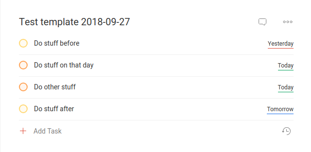

# Todoist Scheduler + Templates
Is this for you?

If you want to:
- store tasks that are in the far future without cluttering your Todoist
- have complex recurring tasks such as `every week pick next item from the list of tasks and schedule it`
- use **templates** for project with ease

then *YES* you should try it.


## Dependencies
- [Dateutil](https://dateutil.readthedocs.io/en/stable/)
- [PyTodoist](https://github.com/Garee/pytodoist)
- [toml](https://github.com/uiri/toml)

## Setup

1. Clone the repo:
    ```bash
    git clone https://github.com/ViliamV/todoist_scheduler.git
    cd todoist_scheduler/
    ```
2. Install the dependencies:
    ```bash
      pip install -r requirements.txt --user
    ```
3. Run `./todoist_scheduler.py --first-start` and follow the instructions

## Usage
```
usage: todoist_scheduler.py [-h] [-f FRONTLOAD] [-v] [--first-start]
                            [--template TEMPLATE] [--date DATE]
Todoist Scheduler can store future one-time or recurring tasks for Todoist in
plain text and create a task in Todoist when they are needed. Also offers more
features regarding a set of repeating tasks.
optional arguments:
  -h, --help           show this help message and exit
  -f FRONTLOAD         Useful when you are going to be away from computer for
                       X days. Use X as a parameter.
  -v                   Verbose output.
  --first-start        First start of a script. Creates login information file
                       and default config.
  --template TEMPLATE  Run template file TEMPLATE
  --date DATE          due date for project in YYYY-MM-DD format (defaults to
                       today)
```

## Creating tasks
You can create tasks using `task_creator.py`.
They will be stored in directories `tasks`, but you can change it in `todoist_scheduler.conf`.
Each task is a separate plain text file in [TOML format](https://github.com/toml-lang/toml) that can be easily modified.
To modify or create a new task, follow these conventions:

- `project` - the name of Todoist project. If in doubt, use `"Inbox"`.
- `tasks` - task/tasks. Add as many as you want. They are strings (`" "`) in the array (`[  ]`)
- `date` - ISO format of due date of the next task
- `early` - how many days in advance should be task put into Todoist. Number followed by word (or starting letter of a word) day/week/month/year.
- `interval` - for recurring tasks is an interval of repetition. It is a string containing number followed by word (or starting letter of a word) day / week / month / month on the last day / year.
- `index` - for recurring tasks this is an index of the next task to be processed, indexing starts from 0.
- `priority` - integer. 0 = no priority, 1 = low priority, 2 = normal priority, 3 = high priority, 4 = very high priority. The default value is 2.

## Creating templates
Templates are TOML files as well.
Example template looks like this:
```toml
name = "Test template"
color = "RED"
priority = 2

[[tasks]]
task = "Do stuff before"
when = -1

[[tasks]]
task = ["Do stuff on that day", "Do other stuff"]
priority = 3

[[tasks]]
task = "Do stuff after"
when = +1
```

- every parameter is optional
- `name` defaults to 'Template'
- `color` defaults to 'LIGHT\_BLUE'
  Use one of the following:
    * GREEN
    * PINK
    * LIGHT\_ORANGE
    * YELLOW
    * DARK\_BLUE
    * BROWN
    * PURPLE
    * GRAY
    * RED
    * DARK\_ORANGE
    * CYAN
    * LIGHT\_BLUE
- `priority` defaults to 2 (normal), task priority is used over project priority
- `when` is delta in days (plus or minus) from the project date and it defaults to 0
- `task` can be string or an array of strings

You can execute template by running `./todoist_scheduler.py --template example_template.toml --date 2018-09-27`

This is the result:



## Automation
### Running at startup
The best use of Todoist Scheduler is to run it in the background every time you start your computer (which is presumably every day).
One way of achieving it is to create a bash script, for example, `launcher.sh` containing following:
```bash
#!/bin/sh
# launcher.sh
sleep 20
sudo python3 /path/to/todoist_scheduler.py
exit 0
```
Next, you want to make it executable:
```bash
    $ chmod u+x launcher.sh
```
Finally, edit `/etc/rc.local` and add line `/path/to/launcher.sh`.

### Bash aliases
In order to speed up adding a new task, you can create aliases in you `.bashrc` or `.bash_aliases`:
```bash_aliases
alias task='python3 /path/to/todoist_scheduler/task_creator.py'
alias todoist='python3 /path/to/todoist_scheduler/todoist_scheduler.py'
```

## Front-loading
When you will not be able to execute the script for the next `x` days, run:
```bash
    $ ./todoist_scheduler.py -f x
```

## Motivation
I made Todoist Scheduler because I wanted more control over my recurring tasks in Todoist.
I spend some time every week decluttering  - deleting old contacts, archiving emails, organizing files.
I liked the idea of having a list of tasks and looping over it in Todoist in specified intervals. However, to my knowledge, it is not possible.
That's why I created this script and liked the clean look of empty Todoist (no recurring tasks that are not needed for 2 months) so I extended the functionality to one-time tasks as well.
Recently I also added support for Project templates which is more useful than I expected.
